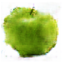
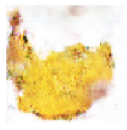
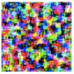
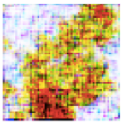
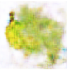
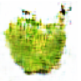
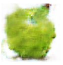
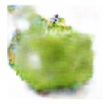
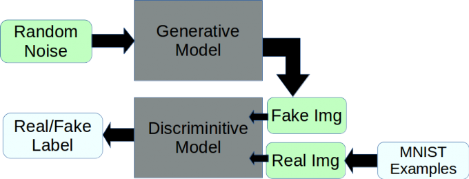
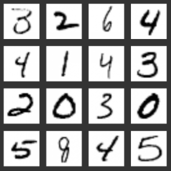

# AIにりんごを描いてもらった

## こんな感じ

### 生成結果(64x64 png)

   


### 途中結果

 ite0

 ite20

 ite100

 ite200

 ite300

 ite400

 ite500


## 背景

最近GAN（Generative Adversarial Network）で、いろんな画像を自動生成したり、ポスターも生成するなどの記事はたくさん目に入る。

どこまで出来るかを試してみたかった。


## 実現の仕方



こちら数字画像生成のgithubソースを参考し、改造した。 [2]



## わかったこと

* Convolution Networkの方は、Full Connected Networkより、生成した画像がスムーズ。 Full Connected Networkの場合は、どうしても雑音が入る。

* 通常のGANはハイパーパラメータに敏感。収束しないことがある。より安定性のあるDRAGANなどは今後試すべき。


## Usage


```
$ python3 origin-dcgan.py
```


## 参考

[1] <https://oshearesearch.com/index.php/2016/07/01/mnist-generative-adversarial-model-in-keras/>

[2] <https://github.com/osh/KerasGAN>

[3] <https://medium.com/towards-data-science/gan-by-example-using-keras-on-tensorflow-backend-1a6d515a60d0>
